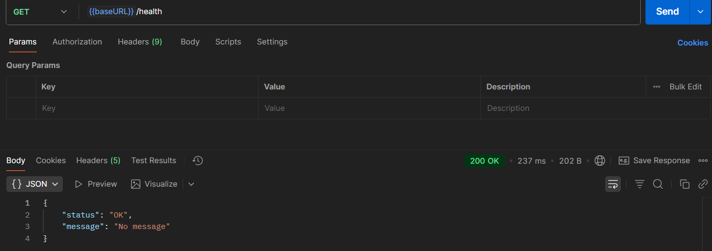
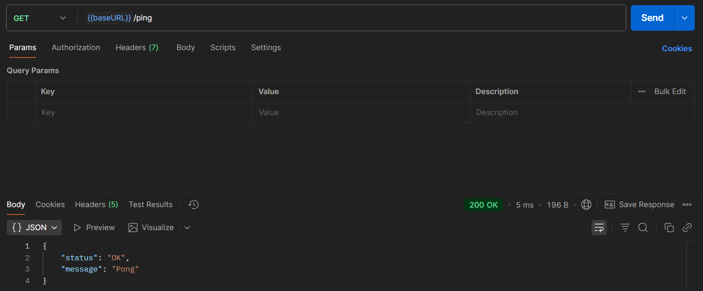
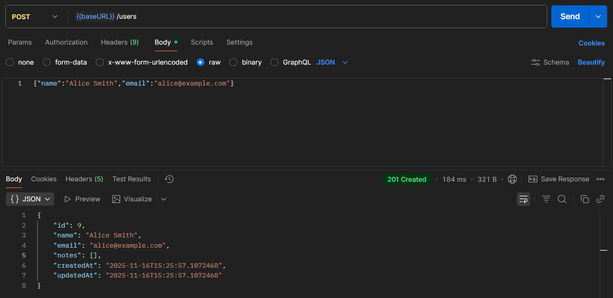
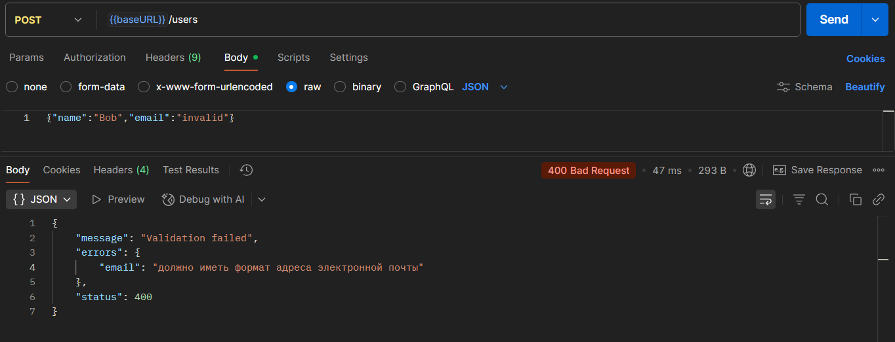
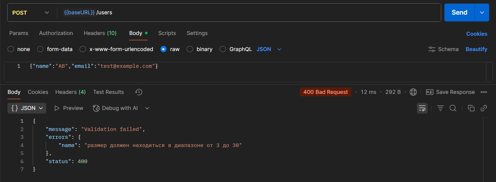
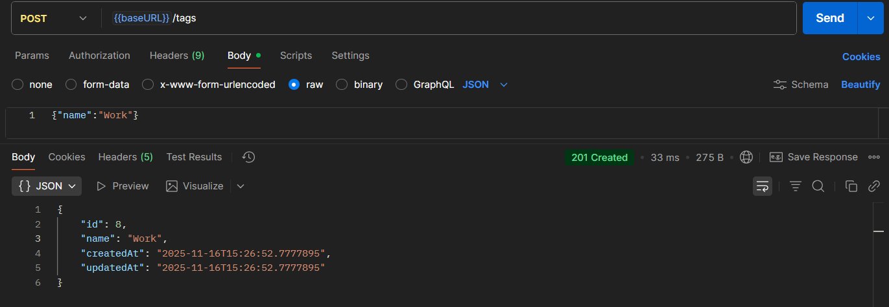
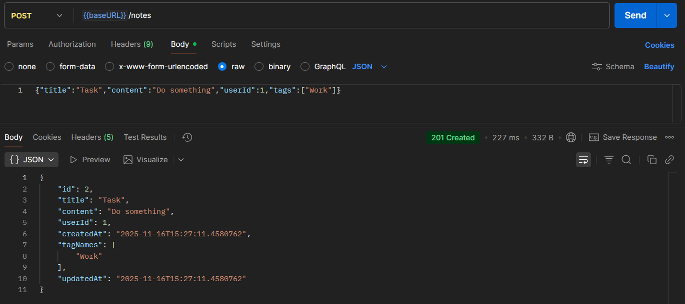
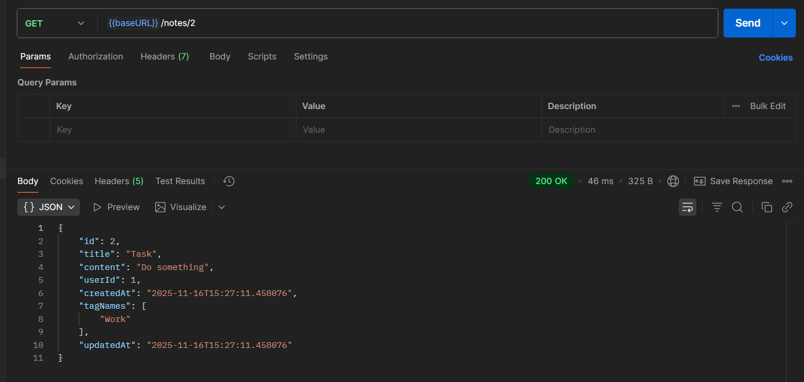
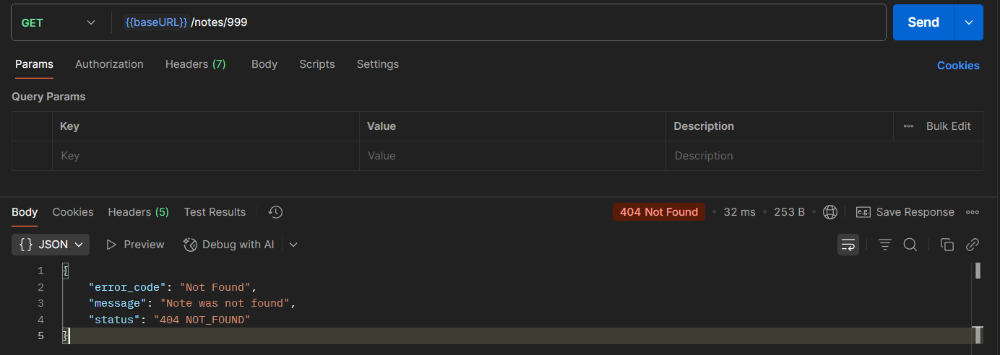

# Практическое занятие №6: REST API для управления заметками пользователей

## Выполнил: Туев Д. ЭФМО-01-25

## Описание проекта

REST API сервис для управления заметками пользователей с поддержкой тегирования. Система позволяет создавать пользователей, теги и заметки с возможностью связывания заметок к пользователям и назначением им нескольких тегов. Проект реализован на базе Spring Boot 3.5.7 с использованием реляционной базы данных PostgreSQL, ORM Hibernate через Spring Data JPA, валидацией входных данных и централизованной обработкой ошибок.

### Стек технологий

В проекте используются следующие технологии и инструменты:
- **Spring Boot 3.5.7** — основной фреймворк приложения
- **Spring Web** — для разработки REST API
- **Spring Data JPA** — ORM для работы с базой данных через Hibernate
- **Spring Validation** — валидация входных данных с использованием Jakarta Validation
- **Lombok** — сокращение шаблонного кода (геттеры, сеттеры, конструкторы)
- **Maven** — управление зависимостями и сборка проекта
- **Java 17** — язык программирования
- **PostgreSQL** — реляционная база данных

### Поддерживаемые запросы

**Легенда:** 🟢 Создание · 🔵 Чтение

| Метод         | Эндпоинт             | Действие              | Ответ            | Тело ответа              |
| ------------- | -------------------- | --------------------- | ---------------- | ------------------------ |
| 🔵 **GET**    | `/health`            | Проверка здоровья     | `200 OK`         | `JSON` статус сервиса    |
| 🔵 **GET**    | `/ping`              | Проверка доступности  | `200 OK`         | `JSON` "Pong"            |
| 🟢 **POST**   | `/users`             | Создать пользователя  | `201 Created`    | `JSON` созданного пользователя |
| 🟢 **POST**   | `/tags`              | Создать тег           | `201 Created`    | `JSON` созданного тега   |
| 🟢 **POST**   | `/notes`             | Создать заметку       | `201 Created`    | `JSON` созданной заметки |
| 🔵 **GET**    | `/notes/{id}`        | Получить заметку      | `200 OK`         | `JSON` объект заметки    |

### Формат данных

Тело запроса (POST /users):
```json
{
  "name": "John Doe",
  "email": "john.doe@example.com"
}
```

Тело запроса (POST /tags):
```json
{
  "name": "Important"
}
```

Тело запроса (POST /notes):
```json
{
  "title": "Meeting Notes",
  "content": "Discussion about project timeline",
  "userId": 1,
  "tags": ["Important", "Work"]
}
```

### Структура проекта

```
my/learn/mireaffjpractice6/
├── config/
│   └── WebConfig.java                          # Конфигурация MVC и регистрация интерцепторов
├── controller/
│   ├── InformationController.java              # Interface для /health и /ping
│   ├── MainController.java                     # Реализация базовых эндпоинтов
│   ├── UserController.java                     # REST API для пользователей
│   ├── TagController.java                      # REST API для тегов
│   └── NoteController.java                     # REST API для заметок
├── dto/
│   ├── request/
│   │   ├── CreateUserRequest.java              # DTO для создания пользователя
│   │   ├── CreateTagRequest.java               # DTO для создания тега
│   │   └── CreateNoteRequest.java              # DTO для создания заметки
│   └── responce/
│       ├── UserDTO.java                        # DTO пользователя для ответов
│       ├── TagDTO.java                         # DTO тега для ответов
│       ├── NoteDTO.java                        # DTO заметки для ответов
│       └── StatusDTO.java                      # DTO для статусных ответов
├── exception/
│   ├── AppException.java                       # Базовое исключение приложения
│   ├── NotFoundException.java                  # Исключение 404
│   ├── InternalServerException.java            # Исключение 500
│   └── handler/
│       └── MainExceptionHandler.java           # Глобальный обработчик ошибок
├── interceptor/
│   └── LoggingInterceptor.java                 # Логирование HTTP запросов
├── model/
│   ├── User.java                               # JPA Entity пользователя
│   ├── Tag.java                                # JPA Entity тега
│   └── Note.java                               # JPA Entity заметки
├── repository/
│   ├── UserRepository.java                     # JPA репозиторий пользователей
│   ├── TagRepository.java                      # JPA репозиторий тегов
│   └── NoteRepository.java                     # JPA репозиторий заметок
├── service/
│   ├── UserService.java                        # Interface сервиса пользователей
│   ├── TagService.java                         # Interface сервиса тегов
│   ├── NoteService.java                        # Interface сервиса заметок
│   └── impl/
│       ├── UserServiceImpl.java                 # Реализация бизнес-логики User
│       ├── TagServiceImpl.java                  # Реализация бизнес-логики Tag
│       └── NoteServiceImpl.java                 # Реализация бизнес-логики Note
├── util/
│   ├── ObjectMapper.java                       # Interface маппера Entity -> DTO
│   └── impl/
│       └── ObjectMapperImpl.java                # Реализация маппера
└── MireaFfjPractice6Application.java           # Главный класс приложения
```

## Тестирование

Для тестирования данного API разработана [Postman коллекция](https://lively-flare-564043.postman.co/workspace/My-Workspace~fe2081e8-b325-4776-8b48-400d41f5b4bd/collection/42992055-e3247867-9843-4fd9-b265-f1b823d03566?action=share&source=copy-link&creator=42992055)

### Обработка ошибок и коды ответа

| Код | Название | Где обрабатывается | Что значит / когда возвращается |
| :-- | :-- | :-- | :-- |
| 200 | OK | `getHealth`, `ping`, `getNoteById` | Успешный ответ с данными (статус сервиса, заметка по ID). |
| 201 | Created | `createUser`, `createTag`, `createNote` | Ресурс успешно создан, в теле возвращается JSON с объектом. |
| 400 | Bad Request | `createUser`, `createTag`, `createNote` | Некорректные данные запроса: пустой JSON, ошибка валидации, неверный формат. |
| 404 | Not Found | `getNoteById`, `findUserById`, `findTagByName` | Заметка, пользователь или тег с указанным ID/именем не найден. |
| 500 | Internal Server Error | `MainExceptionHandler` | Непредвиденная ошибка сервера. |

### Тест кейсы

| № | Наименование | Маршрут | Запрос (пример) | Ожидаемый ответ |
|--|--|--|--|--|
| 1 | Проверка здоровья сервиса | **GET /health** | - | 200 OK + JSON статус |
| 2 | Проверка доступности (ping) | **GET /ping** | - | 200 OK + "Pong" |
| 3 | Создание пользователя | **POST /users** | `{"name":"Alice Smith","email":"alice@example.com"}` | 201 Created + JSON пользователя |
| 4 | Создание пользователя (invalid email) | **POST /users** | `{"name":"Bob","email":"invalid"}` | 400 Bad Request |
| 5 | Создание пользователя (name too short) | **POST /users** | `{"name":"AB","email":"test@example.com"}` | 400 Bad Request |
| 6 | Создание тега | **POST /tags** | `{"name":"Work"}` | 201 Created + JSON тега |
| 7 | Создание заметки | **POST /notes** | `{"title":"Task","content":"Do something","userId":1,"tags":["Work"]}` | 201 Created + JSON заметки |
| 8 | Получение заметки по ID | **GET /notes/1** | - | 200 OK + JSON заметки |
| 9 | Получение несуществующей заметки | **GET /notes/999** | - | 404 Not Found |

### Результаты тестирования

#### 1. Проверка здоровья сервиса



Результат: **HTTP 200 OK**, возвращает статус сервера.

#### 2. Проверка доступности (ping)

XXX

Результат: **HTTP 200 OK**, возвращает "Pong".

#### 3. Создание пользователя

XXX

Результат: **HTTP 201 Created**, возвращает созданного пользователя с ID и временными метками.

#### 4. Создание пользователя с некорректным email

XXX

Результат: **HTTP 400 Bad Request**, возвращает ошибку валидации.

#### 5. Создание пользователя с коротким именем



Результат: **HTTP 400 Bad Request**, возвращает ошибку валидации (минимум 3 символа).

#### 6. Создание тега



Результат: **HTTP 201 Created**, возвращает созданный тег с ID и временными метками.

#### 7. Создание заметки



Результат: **HTTP 201 Created**, возвращает созданную заметку с привязанными тегами.

#### 8. Получение заметки по ID



Результат: **HTTP 200 OK**, возвращает заметку с информацией о пользователе и тегах.

#### 9. Получение несуществующей заметки



Результат: **HTTP 404 Not Found**, возвращает сообщение об ошибке "Note was not found".

## Настройка сервера

### Переменные окружения

Для корректной работы приложения необходимо указать следующие переменные окружения:

| Наименование | Описание | Пример |
|------------|----------|----------|
| DB_URL | URL подключения к PostgreSQL БД | jdbc:postgresql://localhost:5432/notes_db |
| DB_USER | Имя пользователя БД | postgres |
| DB_PASSWORD | Пароль пользователя БД | password |

## Дополнительно

### Теоретические основы

#### REST API и его принципы

REST (Representational State Transfer) — это архитектурный стиль для проектирования веб-сервисов. Основные принципы REST:

- **Ресурсность**: каждый ресурс имеет уникальный URL и может быть представлен в различных форматах (JSON, XML)
- **Использование стандартных HTTP методов**: GET, POST, PUT, PATCH, DELETE для выполнения операций CRUD
- **Stateless архитектура**: каждый запрос содержит всю необходимую информацию, сервер не хранит состояние клиента
- **Единообразный интерфейс**: одинаковая структура запросов и ответов для всех ресурсов
- **Масштабируемость**: возможность добавления новых серверов без изменения архитектуры

#### JPA и ORM паттерн

JPA (Java Persistence API) — это спецификация для взаимодействия с базами данных из Java приложений. Spring Data JPA предоставляет удобный абстракционный слой:

- **Entity** — класс, сопоставленный с таблицей БД через аннотации
- **Repository** — интерфейс для выполнения CRUD операций над данными
- **Relationships** — поддержка связей One-to-Many, Many-to-Many и т.д.

#### Многослойная архитектура

Проект использует классическую трёхслойную архитектуру:

- **Controller слой** — обработка HTTP запросов, валидация входных данных
- **Service слой** — бизнес-логика приложения
- **Repository слой** — доступ к данным через ORM

Такое разделение повышает тестируемость, масштабируемость и поддерживаемость кода.

#### DTO паттерн

DTO (Data Transfer Object) — паттерн для передачи данных между слоями приложения:

- Отделяет внутреннее представление данных от внешнего API
- Позволяет передавать различные наборы полей в запросах и ответах
- Улучшает безопасность, скрывая внутреннюю структуру Entity

### Ключевые фрагменты кода

#### 1. Определение Entity с отношениями

```java
@Entity
@Table(name = "notes")
@Data
@Builder
public class Note {
    @Id
    @GeneratedValue(strategy = GenerationType.IDENTITY)
    private Long id;

    @Column
    private String title;

    @ManyToOne(fetch = FetchType.EAGER, cascade = CascadeType.ALL)
    @JoinColumn(name = "user_id")
    private User user;

    @ManyToMany
    @JoinTable(
        name = "note_tags",
        joinColumns = @JoinColumn(name = "note_id"),
        inverseJoinColumns = @JoinColumn(name = "tag_id")
    )
    private List<Tag> tags;

    @Column
    private LocalDateTime createdAt;

    @Column
    private LocalDateTime updatedAt;
}
```

#### 2. REST контроллер с валидацией

```java
@RestController
@RequestMapping("/notes")
@RequiredArgsConstructor
public class NoteController {

    private final NoteService noteService;
    private final ObjectMapper mapper;

    @PostMapping
    public ResponseEntity<NoteDTO> createNote(@Valid @RequestBody CreateNoteRequest noteRequest) {
        Note note = noteService.createNote(noteRequest);
        NoteDTO noteDTO = mapper.mapToDTO(note);
        return new ResponseEntity<>(noteDTO, HttpStatus.CREATED);
    }

    @GetMapping("/{id}")
    public ResponseEntity<NoteDTO> getNoteById(@PathVariable Long id) {
        Note note = noteService.getNoteById(id);
        NoteDTO noteDTO = mapper.mapToDTO(note);
        return new ResponseEntity<>(noteDTO, HttpStatus.OK);
    }
}
```

#### 3. Сервис с бизнес-логикой

```java
@Service
@RequiredArgsConstructor
@Transactional
public class NoteServiceImpl implements NoteService {

    private final NoteRepository noteRepository;
    private final UserService userService;
    private final TagService tagService;

    @Override
    public Note createNote(CreateNoteRequest noteRequest) {
        User user = userService.findUserById(noteRequest.getUserId());
        List<Tag> tags = tagService.getTagsByName(noteRequest.getTags());
        
        Note note = Note.builder()
                .title(noteRequest.getTitle())
                .content(noteRequest.getContent())
                .user(user)
                .tags(tags)
                .createdAt(LocalDateTime.now())
                .updatedAt(LocalDateTime.now())
                .build();
        
        return noteRepository.save(note);
    }

    @Override
    public Note getNoteById(Long id) {
        return noteRepository.findById(id)
                .orElseThrow(() -> new NotFoundException("Note was not found"));
    }
}
```

#### 4. Глобальная обработка ошибок

```java
@RestControllerAdvice
@Slf4j
public class MainExceptionHandler {

    @ExceptionHandler
    public ResponseEntity<Object> handleException(AppException e) {
        Map<String, String> body = new HashMap<>();
        body.put("message", e.getMessage());
        body.put("error_code", e.getErrorCode());
        body.put("status", e.getStatus().toString());
        
        log.warn(e.getMessage());
        return new ResponseEntity<>(body, e.getStatus());
    }
}
```

#### 5. Интерцептор для логирования

```java
@Component
@Slf4j
public class LoggingInterceptor implements HandlerInterceptor {

    @Override
    public boolean preHandle(HttpServletRequest request,
                             HttpServletResponse response,
                             Object handler) throws Exception {
        log.info("{} {}", request.getMethod(), request.getRequestURI());
        return true;
    }
}
```

### Контрольные вопросы

#### 1. Что такое REST API и какие основные принципы его архитектуры?

REST API — это архитектурный стиль для создания веб-сервисов, основанный на протоколе HTTP. Основные принципы REST:

- **Ресурсы** — всё представлено как ресурсы с уникальными URL (например, `/users/1`, `/notes/5`)
- **Методы HTTP** — используются стандартные методы: GET (получение), POST (создание), PUT/PATCH (обновление), DELETE (удаление)
- **Stateless** — сервер не хранит состояние клиента между запросами
- **Представление** — ресурсы передаются в виде JSON/XML
- **Связь** — ответы могут содержать ссылки на связанные ресурсы

#### 2. Какая разница между PUT и PATCH запросами?

- **PUT** — полное обновление ресурса. Необходимо передать все поля объекта. Если какое-то поле не передать, оно может быть обнулено или удалено.
- **PATCH** — частичное обновление. Передаются только те поля, которые нужно изменить. Остальные поля остаются без изменений.

#### 3. Для чего нужна валидация на уровне контроллера?

Валидация входных данных необходима для:

- **Безопасности** — защита от некорректных и вредоносных данных (SQL injection, XSS)
- **Целостности данных** — гарантирует, что в БД попадают только валидные данные
- **Пользовательского опыта** — ранний feedback о неправильном формате данных
- **Производительности** — отсеивает неправильные запросы до выполнения бизнес-логики

#### 4. Почему нужен слой DTO отдельно от Entity?

- **Безопасность** — Entity содержит чувствительные данные, которые не должны быть доступны клиенту
- **Гибкость** — в разных API версиях может быть разное представление одной сущности
- **Производительность** — можно передавать только необходимые поля, без связанных сущностей
- **Маппинг** — DTO может быть результатом объединения нескольких Entity
- **Независимость** — изменение структуры Entity не влияет на API

#### 5. Что такое транзакция и зачем её использовать с аннотацией @Transactional?

Транзакция — это набор операций с БД, которые должны выполниться либо все вместе, либо не выполниться совсем.

`@Transactional` аннотация:

- **ACID гарантия** — обеспечивает atomicity, consistency, isolation, durability
- **Откат при ошибке** — если во время транзакции возникает исключение, все изменения откатываются
- **Оптимизация** — Spring может использовать кэширование и другие оптимизации внутри транзакции

#### 6. Как работает Many-to-Many отношение между Note и Tag?

Many-to-Many отношение реализуется через промежуточную таблицу:

```
notes ──┬──→ note_tags ←──┬── tags
        │  (note_id, tag_id) │
        └─────────────────────┘
```

- Одна заметка может иметь много тегов
- Один тег может быть привязан ко многим заметкам
- При удалении заметки строка в note_tags удаляется (cascade delete)
- При создании заметки можно указать существующие теги

#### 7. Какую роль играет ObjectMapper в проекте?

ObjectMapper преобразует Entity объекты в DTO объекты для передачи клиенту:

- **Отделение ответственности** — Entity знает о БД, DTO знает о API формате
- **Контроль над данными** — можно выбрать, какие поля передавать в ответе
- **Оптимизация** — можно избежать передачи больших связанных объектов
- **Маппинг** — может преобразовывать данные (например, список тегов в список имён тегов)

## Выводы

В результате выполнения практического занятия №6 был разработан полнофункциональный REST API сервис для управления заметками пользователей. Проект демонстрирует применение лучших практик разработки backend-приложений на Java:

**Достигнутые результаты:**

- Реализована многослойная архитектура (Controller → Service → Repository)
- Разработана реляционная модель данных с поддержкой One-to-Many и Many-to-Many отношений
- Внедрена валидация входных данных на уровне контроллеров
- Реализована централизованная обработка исключений через @RestControllerAdvice
- Добавлено логирование HTTP запросов через HandlerInterceptor
- Использован DTO паттерн для отделения внутреннего представления от внешнего API
- Применены JPA аннотации для управления отношениями между сущностями
- Реализована транзакционность для гарантии целостности данных

**Приобретённые навыки:**

- Разработка REST API с использованием Spring Boot и Spring Web
- Работа с Spring Data JPA и реляционными БД (PostgreSQL)
- Проектирование и реализация многослойной архитектуры
- Использование DTO паттерна и ObjectMapper для преобразования данных
- Обработка ошибок и создание единообразного формата ответов об ошибках
- Использование аннотаций для валидации и конфигурации
- Применение транзакций для обеспечения ACID свойств операций

Проект готов к дальнейшему расширению функциональности (добавление методов обновления и удаления, фильтрация и поиск заметок, аутентификация и авторизация, документирование API через OpenAPI/Swagger и т.д.).
